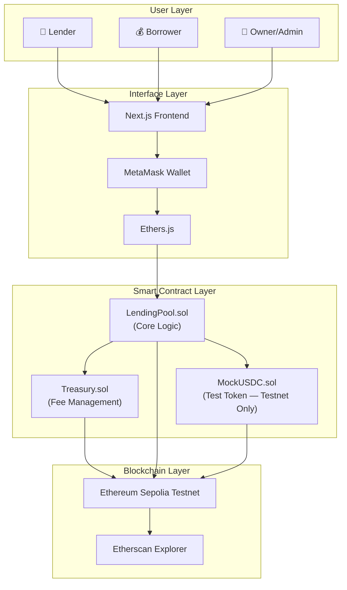
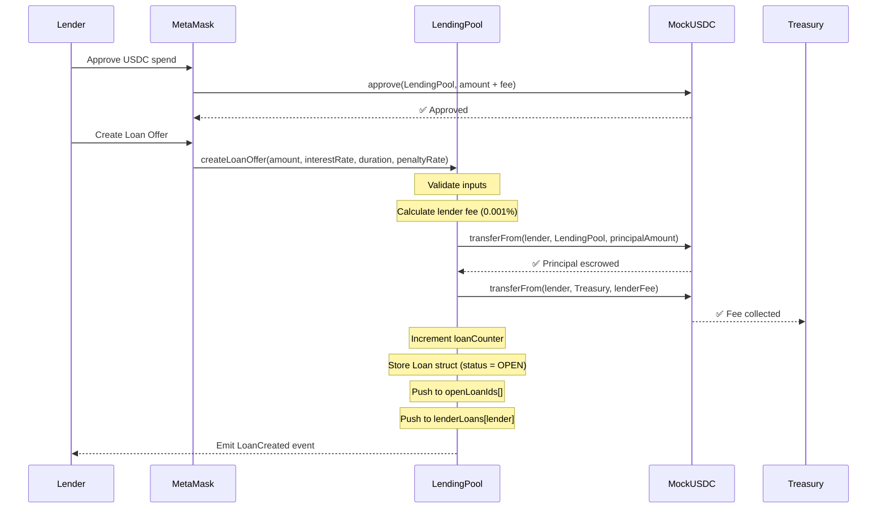
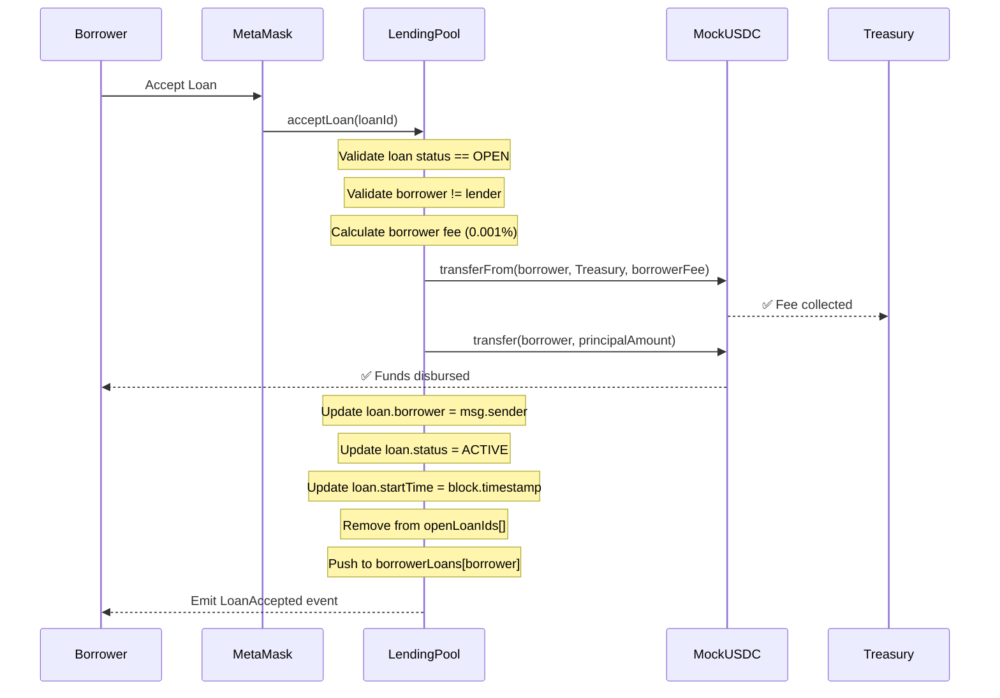
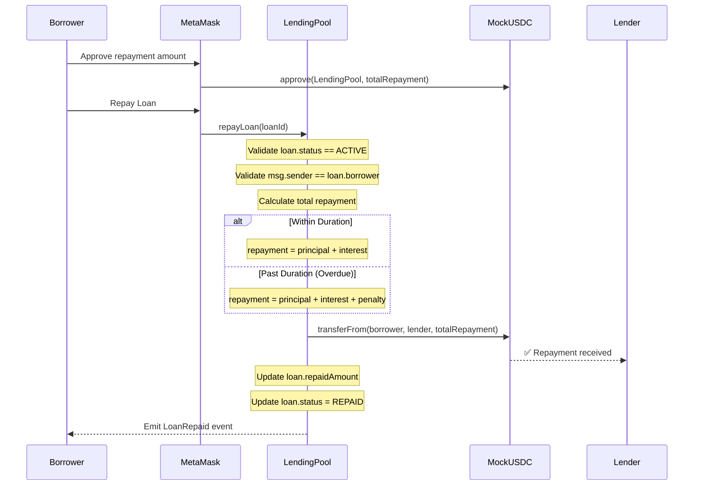
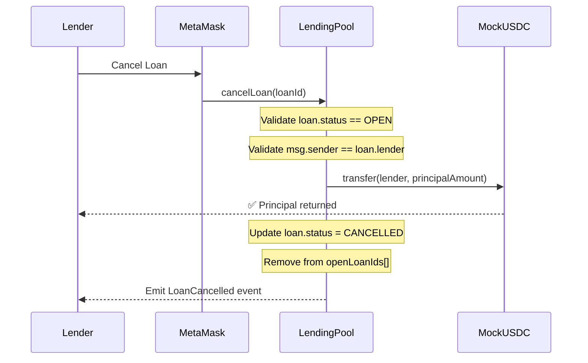
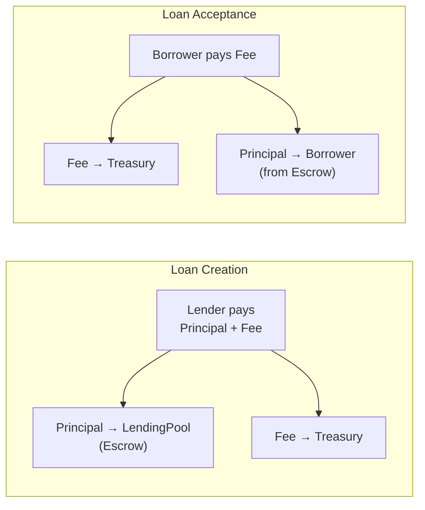
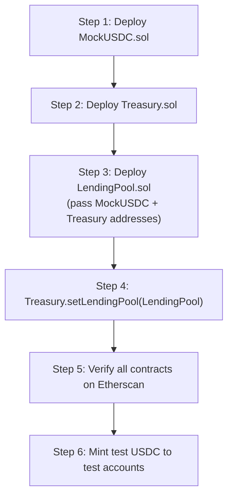
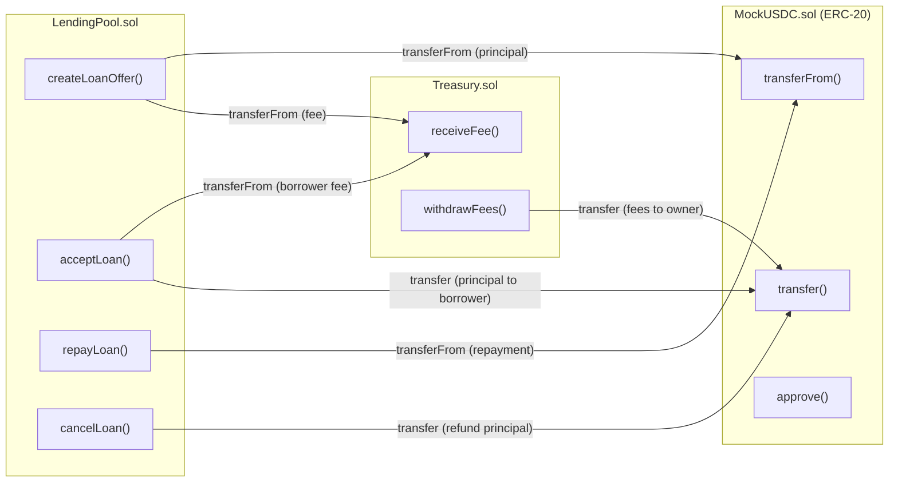

# 🏗️ DeFi Lending Platform — Smart Contract Architecture

> **Author:** Nanda Kishore  
> **Network:** Ethereum Sepolia Testnet  
> **Solidity Version:** ^0.8.20  
> **Framework:** Hardhat + OpenZeppelin  
> **Date:** June 15, 2026

---

## 📐 Architecture Overview

The platform uses a **modular multi-contract architecture** with clear separation of concerns. Three contracts work together to provide a secure, gas-efficient, and upgradable lending system.



---

## 📦 Contract Separation Strategy

### Why Three Contracts?

| Principle | Benefit |
|-----------|---------|
| **Single Responsibility** | Each contract handles one domain |
| **Upgradability Path** | Treasury can be swapped without touching lending logic |
| **Security Isolation** | Fee funds are isolated from lending pool funds |
| **Gas Optimization** | Smaller contracts = cheaper deployment |
| **Auditability** | Easier to audit focused, smaller contracts |

---

### Contract #1: `LendingPool.sol` — Core Lending Engine

> **Role:** The brain of the platform. Manages the entire loan lifecycle.

**Responsibilities:**
- Loan offer creation by lenders
- Loan marketplace (querying available offers)
- Loan acceptance by borrowers
- Loan repayment processing
- Loan cancellation
- Fee calculation and forwarding to Treasury
- Loan status management
- Access control enforcement

**Inherits From:**
- `ReentrancyGuard` (OpenZeppelin) — Prevents reentrancy attacks
- `Ownable` (OpenZeppelin) — Admin-only functions
- `Pausable` (OpenZeppelin) — Emergency circuit breaker

**External Dependencies:**
- References `Treasury.sol` address for fee transfers
- References `MockUSDC.sol` (or any ERC-20) for token transfers

---

### Contract #2: `Treasury.sol` — Fee Vault

> **Role:** Secure vault that collects, holds, and disburses platform fees.

**Responsibilities:**
- Receive platform fees from LendingPool
- Track total fees collected
- Allow owner to withdraw accumulated fees
- Maintain fee accounting per token type
- Emergency withdrawal capability

**Inherits From:**
- `Ownable` (OpenZeppelin) — Only owner can withdraw
- `ReentrancyGuard` (OpenZeppelin) — Safe withdrawals

**Design Rationale:**  
Separating the Treasury ensures that platform revenue is **never mixed** with active loan funds. Even if LendingPool has a vulnerability, the Treasury remains isolated.

---

### Contract #3: `MockUSDC.sol` — Test Token (Testnet Only)

> **Role:** ERC-20 token simulating USDC for testnet development.

**Responsibilities:**
- Mint test tokens to developers/testers
- Standard ERC-20 transfer/approve/transferFrom
- Faucet function for easy testing

**Inherits From:**
- `ERC20` (OpenZeppelin) — Full ERC-20 implementation
- `Ownable` (OpenZeppelin) — Controlled minting

> [!IMPORTANT]
> `MockUSDC.sol` is **NOT** deployed to mainnet. On mainnet, the platform integrates with the real USDC contract at `0xA0b86991c6218b36c1d19D4a2e9Eb0cE3606eB48`.

---

## 🗄️ Storage Structures

### Core Loan Struct

```solidity
struct Loan {
    uint256 loanId;           // Unique identifier (auto-incremented)
    address lender;           // Lender's wallet address
    address borrower;         // Borrower's wallet address (address(0) when open)
    uint256 principalAmount;  // Loan amount in token's smallest unit (e.g., 6 decimals for USDC)
    uint256 interestRate;     // Annual interest rate in basis points (e.g., 500 = 5.00%)
    uint256 duration;         // Loan duration in seconds
    uint256 penaltyRate;      // Late payment penalty in basis points (e.g., 200 = 2.00%)
    uint256 startTime;        // Timestamp when loan was accepted (0 when open)
    uint256 repaidAmount;     // Total amount repaid so far
    LoanStatus status;        // Current state of the loan
}
```

### Loan Status Enum

```solidity
enum LoanStatus {
    OPEN,       // 0 — Lender created offer, waiting for borrower
    ACTIVE,     // 1 — Borrower accepted, funds disbursed
    REPAID,     // 2 — Borrower fully repaid the loan
    CANCELLED,  // 3 — Lender cancelled the open offer
    DEFAULTED   // 4 — Loan duration expired without repayment (future use)
}
```

### State Variables — LendingPool.sol

```text
┌─────────────────────────────────────────────────────────────────────────────────┐
│  STORAGE LAYOUT — LendingPool.sol                                               │
├─────────────────────────────────────────────────────────────────────────────────┤
│                                                                                 │
│  uint256  loanCounter                    → Auto-incrementing loan ID            │
│  uint256  PLATFORM_FEE_BPS = 1           → 0.001% = 1 basis point / 1000       │
│  uint256  FEE_DENOMINATOR = 100_000      → Precision denominator for 0.001%    │
│                                                                                 │
│  address  treasuryAddress                → Treasury contract reference          │
│  address  tokenAddress                   → ERC-20 token (USDC) reference       │
│                                                                                 │
│  mapping(uint256 => Loan)  loans         → Loan ID → Loan data                 │
│  mapping(address => uint256[])           → Lender address → their loan IDs     │
│       lenderLoans                                                               │
│  mapping(address => uint256[])           → Borrower address → their loan IDs   │
│       borrowerLoans                                                             │
│                                                                                 │
│  uint256[]  openLoanIds                  → Array of currently open loan IDs    │
│  mapping(uint256 => uint256)             → Loan ID → index in openLoanIds     │
│       openLoanIndex                       (for O(1) removal)                    │
│                                                                                 │
└─────────────────────────────────────────────────────────────────────────────────┘
```

### State Variables — Treasury.sol

```text
┌─────────────────────────────────────────────────────────────────────────────────┐
│  STORAGE LAYOUT — Treasury.sol                                                  │
├─────────────────────────────────────────────────────────────────────────────────┤
│                                                                                 │
│  address  lendingPoolAddress             → Authorized caller for deposits       │
│                                                                                 │
│  mapping(address => uint256)             → Token address → total fees           │
│       totalFeesCollected                    collected for that token             │
│                                                                                 │
│  mapping(address => uint256)             → Token address → total fees           │
│       totalFeesWithdrawn                    withdrawn by owner                   │
│                                                                                 │
└─────────────────────────────────────────────────────────────────────────────────┘
```

---

## 🔁 Data Flow — Complete Operation Flows

### Flow 1: Loan Offer Creation (Lender)



**Validation Rules:**
- `principalAmount > 0`
- `interestRate > 0 && interestRate <= 10000` (max 100%)
- `duration > 0 && duration <= 365 days`
- `penaltyRate <= 5000` (max 50%)
- Lender must have sufficient token balance
- Lender must have approved LendingPool for `principalAmount + fee`

---

### Flow 2: Loan Acceptance (Borrower)



**Validation Rules:**
- `loan.status == OPEN`
- `msg.sender != loan.lender` (cannot borrow from yourself)
- Borrower must have approved LendingPool for `borrowerFee`
- Loan must exist (`loanId < loanCounter`)

---

### Flow 3: Loan Repayment (Borrower)



**Repayment Calculation:**

```text
┌──────────────────────────────────────────────────────────────────┐
│  REPAYMENT FORMULA                                               │
├──────────────────────────────────────────────────────────────────┤
│                                                                  │
│  interest = (principal × interestRate × elapsed) / (365d × 10000)│
│                                                                  │
│  IF (elapsed > duration):                                        │
│    overdueTime = elapsed - duration                              │
│    penalty = (principal × penaltyRate × overdueTime)             │
│              / (365d × 10000)                                    │
│  ELSE:                                                           │
│    penalty = 0                                                   │
│                                                                  │
│  totalRepayment = principal + interest + penalty                 │
│                                                                  │
└──────────────────────────────────────────────────────────────────┘
```

---

### Flow 4: Loan Cancellation (Lender)



> [!NOTE]
> The lender fee paid during creation is **NOT refunded** upon cancellation. This prevents spam loan creation and covers gas costs.

---

## 📢 Events Specification

Events are critical for the frontend to track state changes without polling the blockchain. They also serve as permanent, gas-efficient logs.

### LendingPool Events

| Event | Parameters | When Emitted |
|-------|-----------|--------------|
| `LoanCreated` | `loanId`, `lender`, `principalAmount`, `interestRate`, `duration`, `penaltyRate` | Lender creates a new loan offer |
| `LoanAccepted` | `loanId`, `borrower`, `lender`, `principalAmount`, `startTime` | Borrower accepts an open loan |
| `LoanRepaid` | `loanId`, `borrower`, `lender`, `totalRepaid`, `interest`, `penalty` | Borrower repays the loan in full |
| `LoanCancelled` | `loanId`, `lender`, `principalAmount` | Lender cancels an open offer |
| `TreasuryUpdated` | `newTreasuryAddress` | Owner updates the treasury address |

### Treasury Events

| Event | Parameters | When Emitted |
|-------|-----------|--------------|
| `FeeReceived` | `token`, `amount`, `from`, `loanId` | Fee deposited from LendingPool |
| `FeeWithdrawn` | `token`, `amount`, `to` | Owner withdraws collected fees |
| `LendingPoolUpdated` | `newLendingPool` | Owner updates authorized LendingPool |

### Event Indexing Strategy

```solidity
// Indexed parameters enable efficient filtering in frontend
event LoanCreated(
    uint256 indexed loanId,
    address indexed lender,
    uint256 principalAmount,
    uint256 interestRate,
    uint256 duration,
    uint256 penaltyRate
);

event LoanAccepted(
    uint256 indexed loanId,
    address indexed borrower,
    address indexed lender,
    uint256 principalAmount,
    uint256 startTime
);

event LoanRepaid(
    uint256 indexed loanId,
    address indexed borrower,
    address indexed lender,
    uint256 totalRepaid,
    uint256 interest,
    uint256 penalty
);
```

> [!TIP]
> **Why index up to 3 parameters?** Solidity allows max 3 indexed parameters per event. Index the fields you'll filter by most (loanId, lender, borrower). The frontend uses `ethers.js` event filters like `contract.filters.LoanCreated(null, lenderAddress)` to query efficiently.

---

## 💰 Fee Mechanics — Deep Dive

### Fee Calculation

```text
Platform Fee = 0.001% = 1 / 100,000

┌──────────────────────────────────────────────────────────────┐
│  EXAMPLE: Loan of 10,000 USDC                                │
├──────────────────────────────────────────────────────────────┤
│                                                              │
│  Lender Fee  = 10,000 × 1 / 100,000 = 0.1 USDC             │
│  Borrower Fee = 10,000 × 1 / 100,000 = 0.1 USDC            │
│  Total Platform Revenue = 0.2 USDC per loan                 │
│                                                              │
└──────────────────────────────────────────────────────────────┘
```

### Fee Flow



### Precision Handling

```text
FEE_BPS = 1               (numerator)
FEE_DENOMINATOR = 100,000  (denominator)

fee = (amount * FEE_BPS) / FEE_DENOMINATOR

Why 100,000 and not 10,000?
→ Standard basis points use 10,000 (1 bp = 0.01%)
→ We need 0.001% = 0.1 bp, so we use 100,000 for extra precision
→ 1 / 100,000 = 0.001%
```

> [!WARNING]
> For very small loan amounts (< 100,000 token units), the fee may round down to 0 due to integer division. Consider enforcing a minimum loan amount of 1 USDC (1,000,000 units with 6 decimals) to ensure fees are always collected.

---

## 🔒 Security Architecture

### Attack Surface Analysis & Mitigations

| Attack Vector | Mitigation | Implementation |
|---------------|-----------|----------------|
| **Reentrancy** | Checks-Effects-Interactions pattern + `ReentrancyGuard` | All state updates before external calls |
| **Integer Overflow** | Solidity 0.8.x built-in overflow checks | Compiler-level protection |
| **Front-Running** | No price-sensitive operations in MVP | Loan terms are fixed at creation |
| **Unauthorized Access** | Role-based modifiers | `onlyOwner`, `onlyLendingPool`, custom modifiers |
| **Token Approval Exploit** | Approve exact amounts | Frontend approves `principal + fee` only |
| **Denial of Service** | Bounded loops, pagination | `openLoanIds` uses swap-and-pop removal |
| **Flash Loan Attacks** | No price oracle dependency in MVP | Fixed interest rates, no dynamic pricing |
| **Pausability** | Circuit breaker pattern | `Pausable` modifier on critical functions |

### Access Control Matrix

```text
┌─────────────────────┬─────────┬──────────┬───────┐
│ Function            │ Lender  │ Borrower │ Owner │
├─────────────────────┼─────────┼──────────┼───────┤
│ createLoanOffer()   │   ✅    │    ✅    │  ✅   │
│ acceptLoan()        │   ✅    │    ✅    │  ✅   │
│ repayLoan()         │   ❌    │    ✅*   │  ❌   │
│ cancelLoan()        │   ✅*   │    ❌    │  ❌   │
│ getLoan()           │   ✅    │    ✅    │  ✅   │
│ getOpenLoans()      │   ✅    │    ✅    │  ✅   │
│ pause() / unpause() │   ❌    │    ❌    │  ✅   │
│ setTreasury()       │   ❌    │    ❌    │  ✅   │
│ withdrawFees()      │   ❌    │    ❌    │  ✅   │
├─────────────────────┴─────────┴──────────┴───────┤
│ * = Only the specific lender/borrower of that loan│
└──────────────────────────────────────────────────┘
```

### Modifier Definitions

```text
whenNotPaused          → Blocks all operations during emergency
nonReentrant           → Prevents reentrant calls
onlyOwner              → Restricts to contract deployer
onlyLoanLender(id)     → msg.sender must be loan.lender
onlyLoanBorrower(id)   → msg.sender must be loan.borrower
onlyLendingPool        → Only LendingPool can call (Treasury)
validLoanId(id)        → loanId < loanCounter
```

---

## 📊 View Functions (Gas-Free Queries)

These functions cost no gas (read-only) and power the frontend marketplace:

| Function | Returns | Purpose |
|----------|---------|---------|
| `getLoan(loanId)` | `Loan` struct | Get details of a specific loan |
| `getOpenLoans(offset, limit)` | `Loan[]` | Paginated marketplace listing |
| `getOpenLoanCount()` | `uint256` | Total available loans |
| `getLenderLoans(address)` | `uint256[]` | All loan IDs for a lender |
| `getBorrowerLoans(address)` | `uint256[]` | All loan IDs for a borrower |
| `calculateRepayment(loanId)` | `(principal, interest, penalty, total)` | Preview repayment amount |
| `getTotalFeesCollected(token)` | `uint256` | Total fees in Treasury |

> [!TIP]
> `getOpenLoans()` uses **pagination** (`offset` + `limit`) to avoid unbounded gas consumption when the marketplace grows large. The frontend should load 20-50 loans per page.

---

## ⛽ Gas Optimization Patterns

| Pattern | Applied To | Savings |
|---------|-----------|---------|
| **Tight variable packing** | Loan struct — group `uint256` fields together | ~2,000 gas per SSTORE |
| **Swap-and-pop array removal** | `openLoanIds[]` — O(1) instead of O(n) shift | Prevents DoS on large arrays |
| **Indexed event parameters** | All events — max 3 indexed | Cheaper log lookups |
| **Short-circuit validation** | `require` statements ordered by gas cost | Fail fast on cheap checks |
| **Immutable variables** | `tokenAddress`, `treasuryAddress` (set in constructor) | Save ~2,100 gas per read |
| **Unchecked math where safe** | Loop counters in view functions | Save ~50 gas per iteration |

### Swap-and-Pop Pattern (openLoanIds)

```text
Before removing loanId=3 from [1, 5, 3, 7, 9]:

Step 1: Find index → openLoanIndex[3] = 2
Step 2: Swap with last → [1, 5, 9, 7, 9]
Step 3: Update swapped index → openLoanIndex[9] = 2
Step 4: Pop last → [1, 5, 9, 7]
Step 5: Delete mapping → delete openLoanIndex[3]

Result: O(1) removal instead of O(n) shifting
```

---

## 🚀 Deployment Strategy

### Deployment Order (Critical!)



### Constructor Parameters

```text
MockUSDC.sol:
  → name: "Mock USDC"
  → symbol: "mUSDC"
  → decimals: 6

Treasury.sol:
  → owner: deployer address

LendingPool.sol:
  → tokenAddress: MockUSDC deployed address
  → treasuryAddress: Treasury deployed address
```

### Post-Deployment Configuration

```text
1. Treasury.setLendingPool(LendingPool.address)
   → Authorizes LendingPool to deposit fees

2. MockUSDC.mint(testAccount1, 100_000_000_000)  // 100,000 USDC
   → Funds test accounts for development

3. Verify contracts on Etherscan
   → npx hardhat verify --network sepolia <address> <constructor-args>
```

---

## 📁 Final Contract File Structure

```text
contracts/
├── LendingPool.sol          # Core lending logic (~250-300 lines)
│   ├── Loan struct
│   ├── LoanStatus enum
│   ├── createLoanOffer()
│   ├── acceptLoan()
│   ├── repayLoan()
│   ├── cancelLoan()
│   ├── View functions (paginated queries)
│   └── Admin functions (pause, setTreasury)
│
├── Treasury.sol             # Fee management (~80-100 lines)
│   ├── receiveFee()
│   ├── withdrawFees()
│   ├── Fee accounting mappings
│   └── Admin functions (setLendingPool)
│
├── MockUSDC.sol             # Test ERC-20 token (~30-40 lines)
│   ├── Standard ERC-20 (via OpenZeppelin)
│   ├── mint() — owner only
│   └── faucet() — public, capped
│
scripts/
├── deploy.ts                # Deployment script with proper ordering
│
test/
├── LendingPool.test.ts      # Core logic tests
├── Treasury.test.ts         # Fee management tests
└── Integration.test.ts      # End-to-end flow tests
```

---

## 🧪 Testing Strategy

| Test Category | What to Test |
|---------------|-------------|
| **Unit — LendingPool** | Loan creation, acceptance, repayment, cancellation with valid/invalid inputs |
| **Unit — Treasury** | Fee deposits, withdrawals, access control |
| **Integration** | Full loan lifecycle: create → accept → repay |
| **Edge Cases** | Zero amounts, self-borrowing, double repayment, cancelled loan acceptance |
| **Security** | Reentrancy attempts, unauthorized access, overflow scenarios |
| **Gas Benchmarks** | Gas consumption per operation, pagination limits |

---

## 📐 Contract Interaction Diagram



---

> [!IMPORTANT]
> **Next Step:** Once you approve this architecture, I will generate the complete Solidity smart contract code for all three contracts, the Hardhat configuration, deployment scripts, and test suite.
